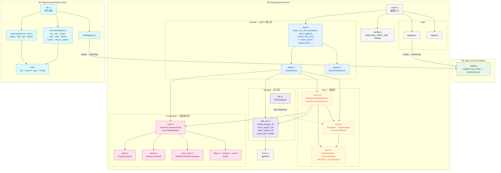
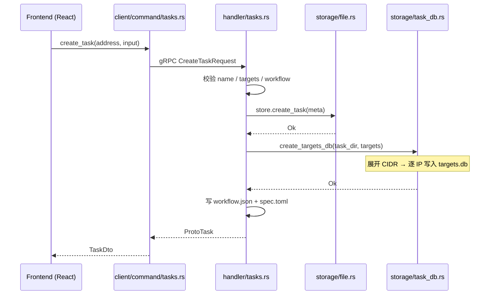
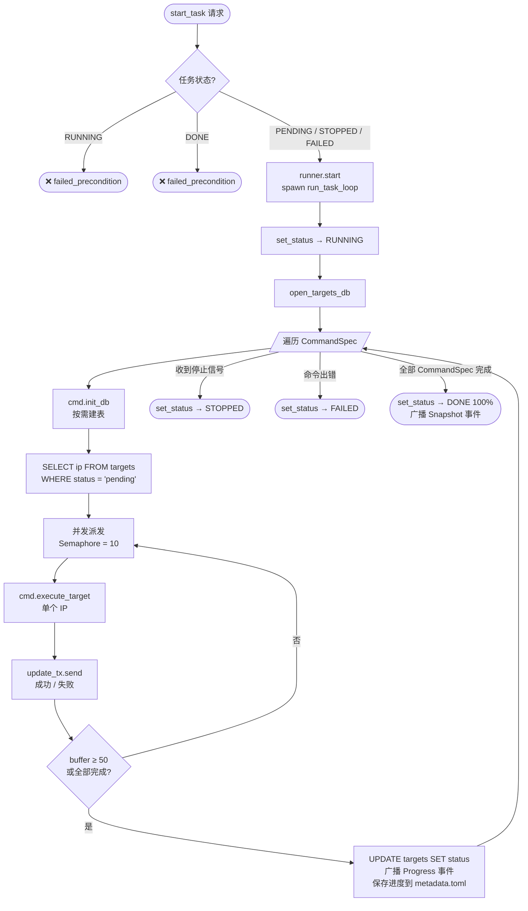
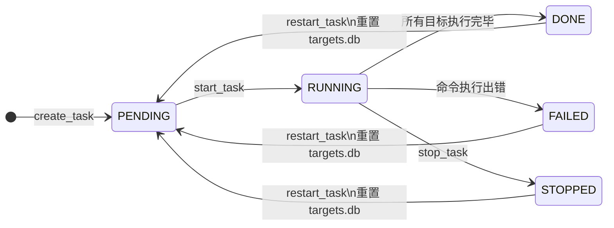

# SuperScanner 架构图

---

## 流程图一：创建任务请求流

---

## 流程图二：任务执行流

---

## 流程图三：任务生命周期状态机

---

## 约定

| 符号 | 含义 |
|------|------|
| 实线 `-->` | 直接依赖（use / instantiate） |
| 虚线 `-.->` | 接口实现（impl Trait） |
| 🟢 绿色 | `super-scanner-shared` |
| 🔵 蓝色 | `handler/` gRPC 接入层 |
| 🟠 橙色 | `core/` 领域层 |
| 🔴 粉色 | `commands/` 扫描命令层 |
| 🟣 紫色 | `storage/` 持久层 |
| ⚫ 灰色 | 入口 / 工具 |
| 🔵 青色 | `SuperScannerClient` |
